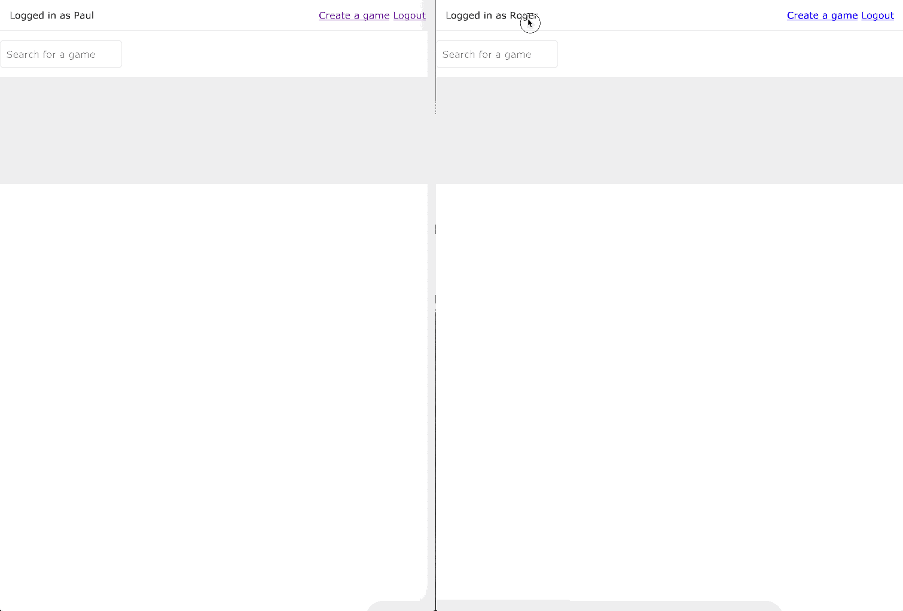

# Unox - A UNO Elixir multiplayer game

This is my entry in [Phoenix Phrenzy](https://phoenixphrenzy.com), showing off what [Phoenix](https://phoenixframework.org/) and [LiveView](https://github.com/phoenixframework/phoenix_live_view) can do.

## The name

The Unox game name has been taken to make sure no copyright infrigment is done using the [Uno](https://en.wikipedia.org/wiki/Uno_(card_game)). This is a public and open source implementation of the game mechanics with multiplayer online support with random name generator.

## About cards

Cards uses svg taken from [https://en.wikipedia.org/wiki/Uno_(card_game)#/media/File:UNO_cards_deck.svg](https://en.wikipedia.org/wiki/Uno_(card_game)#/media/File:UNO_cards_deck.svg) which is under CC0 lisence are granted usage and modification.

## Deployment

How you deploy your app is up to you. A couple of the easiest options are:

- Heroku ([instructions](https://hexdocs.pm/phoenix/heroku.html))
- [Gigalixir](https://gigalixir.com/) (doesn't limit number of connections)

## The Usual README Content

To start your Phoenix server:

  * Install dependencies with `mix deps.get`
  * Install Node.js dependencies with `cd assets && npm install`
  * Start Phoenix endpoint with `mix phx.server`

Now you can visit [`localhost:4000`](http://localhost:4000) from your browser.

Ready to run in production? Please [check our deployment guides](https://hexdocs.pm/phoenix/deployment.html).

## Learn more

  * Official website: http://www.phoenixframework.org/
  * Guides: https://hexdocs.pm/phoenix/overview.html
  * Docs: https://hexdocs.pm/phoenix
  * Mailing list: http://groups.google.com/group/phoenix-talk
  * Source: https://github.com/phoenixframework/phoenix
